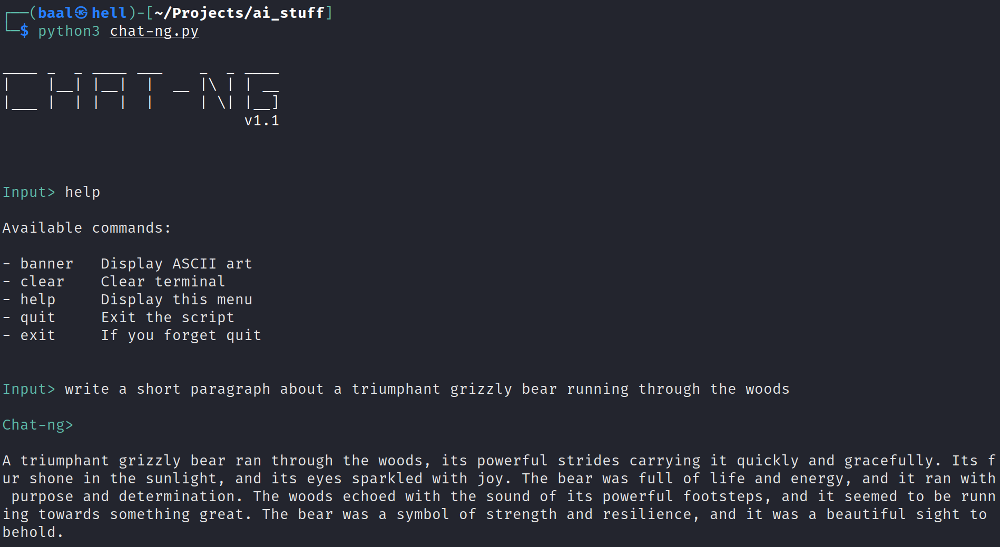
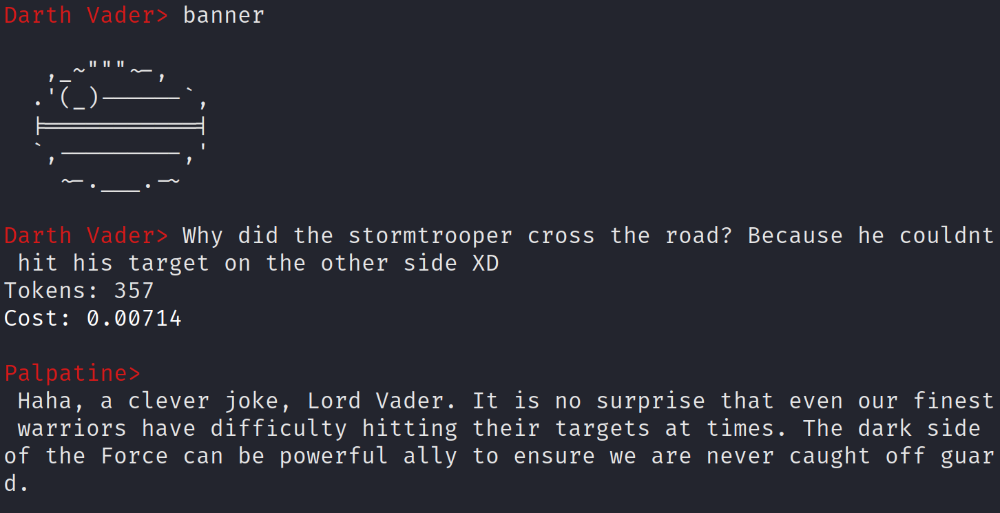

# chat-ng
Wrapper for OpenAI text-davinci-003. It uses text-davinci-003, not ChatGPT.

It requires an API key.

```bash
export OPENAI_API_KEY='YOUR_KEY_HERE'
./chat-ng.py
```

# COST WARNING!

Running this script will incur usage costs through OpenAI's API service. This script does not run for free. Usage costs are displayed after every prompt.

# Example



# Palpatine



# Using libchatng In A Project
```python
import libchatng

libchatng.query("your GPT-3 prompt goes here")
```
